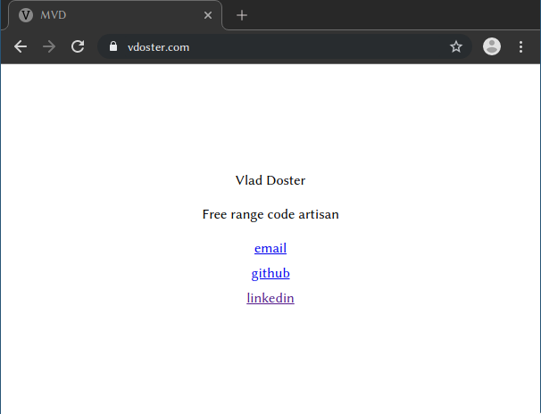

<div align="center">

# Personal website cookiecutter

### Generates a minimialist and informative landing page containing desirable links such as Github and Linkedin. Deploys to Github pages via a CLI tool.



</div>

### Features

- Automatic HTTPS
- Free
- Inline CSS
- CLI tool to enable GH pages programmatically
- Use custom domain

---

#### Stack

- HTML & CSS
- [Cookiecutter](https://cookiecutter.readthedocs.io/en/latest/)
- [Github Pages](https://pages.github.com/)

---

### Usage

1. Install Cookiecutter

```
pip3 install "cookiecutter>=1.4.0"
```

2. Run it against this repo

```
cookiecutter https://github.com/vladdoster/personal-website-cookiecutter.git
```

3. You'll be prompted for some values. Provide them, then a website will be created for you.


```
Cloning into 'Personal-Website-Cookiecutter'...
remote: Counting objects: 550, done.
remote: Compressing objects: 100% (310/310), done.
remote: Total 550 (delta 283), reused 479 (delta 222)
Receiving objects: 100% (550/550), 127.66 KiB | 58 KiB/s, done.
Resolving deltas: 100% (283/283), done.
directory_name [personal-website]: slice-of-internet
email [mvdoster@gmail.com]: dosterm@wit.edu
github_username [vdoster]: vladdoster
html_title [MVD]: MVD
linkedin_url [https://www.linkedin.com/in/vdoster/]: linkedin.vdoster.com
name [Vlad Doster]: Martin V. Doster
short_personal_description [Free range code artisan]: I code with my bare hands
```

4. Create a git repo and push it there:

```
git init
git add .
git commit -m "Initial commit: A new website"
git remote add origin git@github.com:vladdoster/slice-of-internet.git
git push -u origin master
```
---

### Ideas? 

If you want me to add something, [open an issue](https://github.com/vladdoster/minimal-personal-website-cookiecutter/issues/new)
